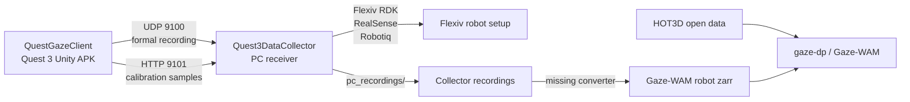

# Gaze Project

Shell repository for the Quest gaze-guided robot policy project.

This repository is the documentation, context, and deployment coordination layer
around three independent code repositories:

| Component | Local path | Upstream repository | Role |
| --- | --- | --- | --- |
| QuestGazeClient | `thirdparty/QuestGazeClient` | `git@github.com:Spphire/QuestGazeClient.git` | Quest 3 Unity client. Sends gaze, head, controller, recording, and calibration telemetry. |
| Quest3DataCollector | `thirdparty/Quest3DataCollector` | `git@github.com:Spphire/Quest3DataCollector.git` | PC receiver for Quest telemetry, Flexiv/RealSense/gripper recording, calibration, replay, and teleop latency analysis. |
| gaze-dp / Gaze-WAM | `thirdparty/gaze-dp` | `git@github.com:Spphire/gaze-dp.git` | Training codebase for HOT3D and future Collector robot demonstrations. |

`thirdparty/*` is intentionally ignored by this shell repo. Manage code changes
inside each component repository and use this repo for cross-component docs,
deployment state, and agent context.

## Documentation

- [docs/index.md](docs/index.md): documentation map and recommended reading order.
- [docs/gaze-project-overview.md](docs/gaze-project-overview.md): system map,
  repositories, protocols, data layout, and open project decisions.
- [docs/deployment-environments.md](docs/deployment-environments.md): venv,
  runtime, and deployment environment inventory.
- [docs/development.md](docs/development.md): local development workflow and git
  ownership boundaries.
- [docs/deployment.md](docs/deployment.md): deployment locations, sync policy,
  and operational checks.
- [docs/usage.md](docs/usage.md): operator workflow for recording, calibration,
  replay, latency inspection, and training handoff.
- [docs/agent-context.md](docs/agent-context.md): compact context for future
  agents.

## Current Architecture



The main missing software bridge remains the Collector recording folder to
canonical Gaze-WAM robot zarr converter.

## Git Policy

Use this repository for shell-level documentation and persistent agent context.
Use each `thirdparty` repository for its own source code commits.

Recommended status check:

```powershell
git -C W:\实验室项目\Gaze-Project status -sb
git -C W:\实验室项目\Gaze-Project\thirdparty\QuestGazeClient status -sb
git -C W:\实验室项目\Gaze-Project\thirdparty\Quest3DataCollector status -sb
git -C W:\实验室项目\Gaze-Project\thirdparty\gaze-dp status -sb
```

Do not commit large datasets, Unity build outputs, venvs, zarr stores, or
recording artifacts into this shell repo.
