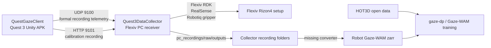

# Gaze Project Overview

Last updated: 2026-07-13, Asia/Shanghai.

This workspace documents the current three-part gaze robotics project: a Quest 3 Unity client records gaze and teleoperation intent, a PC-side Collector receives and records synchronized robot/camera data, and Gaze-WAM trains gaze-conditioned policies from HOT3D plus future robot demonstrations.

## System Map



The main missing bridge is a converter from Collector recording folders to the canonical robot zarr schema expected by Gaze-WAM.

## Repository And Deployment Inventory

| Component | Role | Source of truth checked | Branch and commit | Deployment |
| --- | --- | --- | --- | --- |
| `Gaze-Project` shell | Documentation, deployment notes, and persistent agent context. | `W:\实验室项目\Gaze-Project` | `main`, remote `git@github.com:Spphire/Gaze-Project.git` | Tracks `README.md`, `docs/**`, `.codex/**`, and lightweight workspace metadata. It intentionally ignores `thirdparty/*` source contents. |
| `QuestGazeClient` | Unity Quest 3 client. Sends gaze, headset, controller, and recording events. | `W:\实验室项目\Gaze-Project\thirdparty\QuestGazeClient` | `main`, `dbc9b0d7cb61` | Built APKs exist locally. `W:\lasertag-projs` is now a junction to this path. UnityHub `projects-v1.json` was updated to the new real path. Quest device `2G0YC1ZF940X95` is authorized, package `com.Apricity.EyeTrackingTest` is installed, and ADB launch resumed `UnityPlayerGameActivity`. |
| `Quest3DataCollector` | PC receiver, calibration recorder, Flexiv/RealSense/gripper capture, viewer. | `W:\实验室项目\Gaze-Project\thirdparty\Quest3DataCollector` | `quest3-chessboard-flexiv`, `81b8cfa17ab2` | Running on `lvjun@10.128.0.227:/ssd1/shenyibo/Quest3DataCollector`. Remote folder is not a git repo. `W:\Quest3DataCollector` is now a junction to the workspace path. |
| `gaze-dp` / Gaze-WAM | Training codebase for gaze-conditioned policy. | `W:\实验室项目\Gaze-Project\thirdparty\gaze-dp` | `gaze-wam-cleanup`, `e111c7cdf77a` | Also deployed at `H200-4042:/mnt/workspace/shenyibo/gaze-wam`, now fast-forwarded to `e111c7cdf77a` with clean status and one pre-sync safety stash. `W:\实验室项目\gaze-wam` is now a junction to the workspace path. |
| Workspace thirdparty | Consolidated local project area. | `W:\实验室项目\Gaze-Project\thirdparty\*` | Active for all three local repos | Earlier small mirror clones were removed/replaced by active projects or junctions to active projects to avoid duplicate disk usage. |

## QuestGazeClient

Local project: `W:\实验室项目\Gaze-Project\thirdparty\QuestGazeClient`

Legacy compatibility path: `W:\lasertag-projs` is a junction to the workspace path.

Remote: `git@github.com:Spphire/QuestGazeClient.git`

Unity/package facts:

- Unity version in project: `6000.0.60f1`.
- Android package: `com.Apricity.EyeTrackingTest`.
- Key code:
  - `W:\实验室项目\Gaze-Project\thirdparty\QuestGazeClient\Assets\EyeTracking\Scripts\Recording\QuestRecordingTelemetrySender.cs`
  - `W:\实验室项目\Gaze-Project\thirdparty\QuestGazeClient\Assets\EyeTracking\Scripts\Recording\QuestPcCalibrationRecorder.cs`
  - `W:\实验室项目\Gaze-Project\thirdparty\QuestGazeClient\Assets\EyeTracking\README_QuestRecordingTelemetry.md`

Runtime behavior:

- A button starts/stops formal recording telemetry.
- B button starts/stops PC calibration recording.
- UDP formal telemetry protocol is `quest_recording_telemetry_v1`.
- Default telemetry target is `10.128.0.227:9100`.
- Messages are newline UTF-8 JSON datagrams with event types such as `recording_start`, `sample`, and `recording_stop`.
- Sample fields include `recordId`, `sampleIndex`, `unityTimestampSeconds`, `recordingTimestampSeconds`, gaze ray/point fields, eye/camera poses, and left/right controller state.
- B-button calibration uses HTTP, not UDP:
  - default server URL: `http://10.128.0.227:9101`
  - protocol: `quest_pc_calibration_recording_v1`
  - endpoints: `/calibration/start`, `/calibration/sample`, `/calibration/stop`
- File command bridge on Quest:
  - `/sdcard/Android/data/com.Apricity.EyeTrackingTest/files/record_command.txt`
  - accepted commands include `start`, `stop`, `calib_start`, `calib_stop`, `calib_toggle`.

Known APK outputs:

- `W:\实验室项目\Gaze-Project\thirdparty\QuestGazeClient\Build\EyeTrackingBuild\EyeTrackingTest.apk`
- `W:\实验室项目\Gaze-Project\thirdparty\QuestGazeClient\dist\QuestGazeClient-v2026.06.27-initial.apk`
- `W:\实验室项目\Gaze-Project\thirdparty\QuestGazeClient\ReleaseAssets\v2026.06.27-initial\QuestGazeClient-v2026.06.27-initial.apk`

## Quest3DataCollector

Local project: `W:\实验室项目\Gaze-Project\thirdparty\Quest3DataCollector`

Legacy compatibility path: `W:\Quest3DataCollector` is a junction to the workspace path.

Remote: `git@github.com:Spphire/Quest3DataCollector.git`

Key files:

- `W:\实验室项目\Gaze-Project\thirdparty\Quest3DataCollector\README.md`
- `W:\实验室项目\Gaze-Project\thirdparty\Quest3DataCollector\docs\usage.md`
- `W:\实验室项目\Gaze-Project\thirdparty\Quest3DataCollector\pc\offline_calibration\scripts\quest_pc_receiver.py`
- `W:\实验室项目\Gaze-Project\thirdparty\Quest3DataCollector\pc\offline_calibration\scripts\quest_coordinate_frames.py`
- `W:\实验室项目\Gaze-Project\thirdparty\Quest3DataCollector\pc\offline_calibration\scripts\start_lab_receiver.sh`

Verified remote deployment:

- Host: `lvjun@10.128.0.227`
- Project path: `/ssd1/shenyibo/Quest3DataCollector`
- Python venv: `/ssd1/shenyibo/Quest3DataCollector/.venv312`
- Viewer URL from the lab network: `http://10.128.0.227:8765/`
- Listening ports observed:
  - UDP `9100` for formal Quest telemetry.
  - TCP `9101` for calibration HTTP API.
  - TCP `8765` for viewer.

Observed receiver command:

```bash
/ssd1/shenyibo/Quest3DataCollector/.venv312/bin/python \
  pc/offline_calibration/scripts/quest_pc_receiver.py receive \
  --host 0.0.0.0 --port 9100 \
  --visualize --visualize-host 0.0.0.0 --visualize-port 8765 \
  --no-open-browser \
  --flexiv-network-interface 192.168.2.108 \
  --realsense-serial 244222073667 \
  --third-realsense-serial 750612070265 \
  --robot-state-hz 90 \
  --record-realsense-depth-every-n-frames 3 \
  --record-realsense-depth-format ffv1 \
  --enable-gripper \
  --gripper-device Robotiq-2F-85 \
  --gripper-force 40
```

Recording layout:

- Formal A-button recordings go under `pc/offline_calibration/pc_recordings/<recordId>/`.
- Main files include:
  - `pc_telemetry_raw.jsonl`
  - `pc_samples.jsonl`
  - `pc_controllers.csv`
  - `pc_session_summary.json`
- Robot/camera subfolder, when enabled:
  - `robot_realsense/samples.jsonl`
  - `robot_realsense/robot_states.jsonl`
  - `robot_realsense/video_frames.jsonl`
  - `robot_realsense/controller_motion.jsonl`
  - `robot_realsense/gripper_commands.jsonl`
  - `robot_realsense/cameras.json`
  - `robot_realsense/capture_config.json`
  - video/depth streams and `session_summary.json`.
- Calibration B-button raw data goes under `pc/offline_calibration/raw/<recordId>/`.
- Calibration outputs go under `pc/offline_calibration/outputs/pc_live_calibration/<recordId>/`.
- Robot hand-eye result is expected at `raw/<recordId>/robot_realsense/robot_hand_eye_result.json`.

Coordinate frames:

- Unity raw frame: `unity_world_lh_y_up_z_forward`.
- PC/robot canonical frame: `pc_world_rh_z_up_x_forward`.
- Current conversion: `pc = [unity.z, -unity.x, unity.y]`.

Teleoperation notes:

- Formal recording is asynchronous: Quest samples, robot states, RealSense frames, and gripper state are timestamped and aligned later.
- Right-controller teleoperation depends on a valid Quest-to-robot calibration.
- During A-recording, right hand side/grip trigger enables right-controller teleop.
- Right index trigger controls the gripper when gripper support is enabled.

## Gaze-WAM Training

Local project: `W:\实验室项目\Gaze-Project\thirdparty\gaze-dp`

Legacy compatibility path: `W:\实验室项目\gaze-wam` is a junction to the workspace path.

Remote: `git@github.com:Spphire/gaze-dp.git`

Remote training deployment:

- SSH alias: `H200-4042`
- Path: `/mnt/workspace/shenyibo/gaze-wam`
- Observed remote branch/commit: `gaze-wam-cleanup`, `e111c7cdf77a`
- Remote tree is clean after fast-forward. A pre-sync safety stash remains on H200: `pre-sync dirty tree before e111c7c 2026-07-02`.
- HOT3D processed data: `/mnt/workspace/shenyibo/datasets/HOT3D/processed` around 14 GB.
- Existing HOT3D zarrs:
  - `/mnt/workspace/shenyibo/gaze-wam/data/hot3d_open_train.zarr` around 99 GB.
  - `/mnt/workspace/shenyibo/gaze-wam/data/hot3d_open_val.zarr` around 24 GB.
- Cosmos stats: `/mnt/workspace/shenyibo/gaze-wam/data/outputs/cosmos_heatmap_latent_stats/hot3d_open_ci16x16_random4096_seed42.json`.

Key files:

- `W:\实验室项目\Gaze-Project\thirdparty\gaze-dp\README.md`
- `W:\实验室项目\Gaze-Project\thirdparty\gaze-dp\docs\README.md`
- `W:\实验室项目\Gaze-Project\thirdparty\gaze-dp\diffusion_policy\dataset\gaze_wam_dataset.py`
- `W:\实验室项目\Gaze-Project\thirdparty\gaze-dp\diffusion_policy\scripts\canonicalize_robot_gaze_wam_zarr.py`
- `W:\实验室项目\Gaze-Project\thirdparty\gaze-dp\diffusion_policy\scripts\prepare_robot_gaze_wam_zarr.py`
- `W:\实验室项目\Gaze-Project\thirdparty\gaze-dp\diffusion_policy\scripts\validate_gaze_wam_zarr.py`

Current training status:

- HOT3D/open-only path is already wired.
- Robot/action side is partially wired through dataset and canonicalization scripts.
- The missing piece is a Collector recording folder to robot zarr converter.

Expected canonical robot zarr fields:

- `data/camera0_rgb`: image array, typically 256x256 RGB, either `[N,H,W,3]` or `[N,3,H,W]`.
- `data/gaze_xy`: normalized gaze coordinates `[N,2]`.
- `data/action_abs_tcp`: canonical action, expected 10D when including gripper.
- `data/tcp_pose_abs`: robot TCP pose, usually 9D or 10D depending on representation.
- `data/gripper_width`: `[N]` or `[N,1]`.
- Optional fields include `gaze_heatmap`, `has_gaze_label`, `has_heatmap_image`, `has_action_abs`, timestamp streams.
- `meta/episode_ends`: cumulative episode boundaries.

## Missing Converter Sketch

The converter should read one or more Collector formal recording folders and write a raw or canonical zarr that can be passed through the existing Gaze-WAM tooling.

Minimum input streams:

- Quest/PC samples from `pc_samples.jsonl` or `pc_telemetry_raw.jsonl`.
- RealSense frame index/timestamps from `robot_realsense/video_frames.jsonl`.
- End-camera video frames or another confirmed policy camera.
- Robot TCP states from `robot_realsense/robot_states.jsonl`.
- Gripper width/state or gripper commands from `robot_realsense/gripper_commands.jsonl` and related logs.
- Episode metadata from `pc_session_summary.json` and `robot_realsense/session_summary.json`.

Minimum output behavior:

- Timestamp-align each policy step to the selected camera frame.
- Project/transform gaze into normalized image coordinates for `gaze_xy`, or mark missing gaze explicitly.
- Produce `action_abs_tcp`, `tcp_pose_abs`, and gripper signals with the semantics confirmed by the project owner.
- Write `meta/episode_ends`.
- Run `prepare_robot_gaze_wam_zarr.py` and `validate_gaze_wam_zarr.py` after conversion.

## Current Open Questions

These should be confirmed with the project owner and then synchronized back into this document and `docs/agent-context.md`.

1. Which RealSense serial is the end-effector policy camera now? The remote receiver currently uses `--realsense-serial 244222073667` and `--third-realsense-serial 750612070265`, while older notes suggested `750612070265` might have been the end/checkerboard camera.
2. Should the remote Collector at `/ssd1/shenyibo/Quest3DataCollector` be converted into a git checkout, rsynced from `W:\实验室项目\Gaze-Project\thirdparty\Quest3DataCollector`, or intentionally kept as an unmanaged deployment copy?
3. Which image stream should become `data/camera0_rgb`: end RealSense, third RealSense, Quest passthrough-derived image, or another camera?
4. For `action_abs_tcp`, should the training target use actual executed robot TCP trajectory, controller-derived commanded target, or a future action target computed from adjacent robot states?
5. What is the preferred gripper label source: measured gripper width, command log, or binary open/close derived from trigger input?
